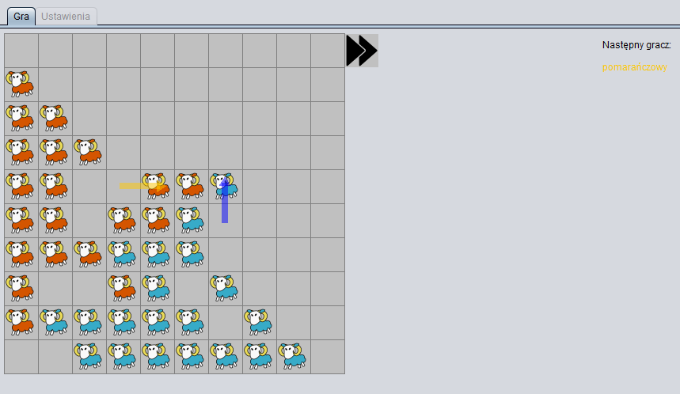

# Migration - A Game playing Agent

Following is a Java implementation of a MCTS-search player for Go-variant called "Migration". Created as final project for 5-th semester _Artificial Intelligence_ subject course at Poznan University of Technology.   



Core of the agent is low-level board implementation for fast move simulation with regular Monte Carlo Tree Search implementation on top.

Whole environment to run the agent with the "Migration" game variant excluding `Players` folder was prepared by the University. Unfortunatelly it had to be removed due to licesing concerns.  

Rules regarding this GO variant can be found [here](http://www.di.fc.ul.pt/~jpn/gv/migration.htm).
Results from conducted research on board game complexity can be found inside `research` directory.


## Compilation

Compile all JARs in root directory.

```
mvn clean package
```

## Execution (outdated)

Run the visual version of the game (Proper selection of parameters using GUI)

```bash
java -jar .\src\GUI\target\GUI-2.0-SNAPSHOT.jar 
```

General cmd for launching cli-game fight for two agents is following:

```bash
java -jar <game-cli> <agent1> <agent2> migration <board-size> <time_limit_ms>
```

Run battle between the same variant of MCTS bot with `board-size=8` and `think-limit=1000ms`: 

```bash
java -jar .\src\CLI\target\CLI-2.0-SNAPSHOT.jar .\src\Players\MCTSPlayer\target\MCTSPlayer-2.0-SNAPSHOT.jar .\src\Players\MCTSPlayer\target\MCTSPlayer-2.0-SNAPSHOT.jar migration 8 1000
```

Under `scripts` directory one can find script for generating scripted fights between the bots. 


